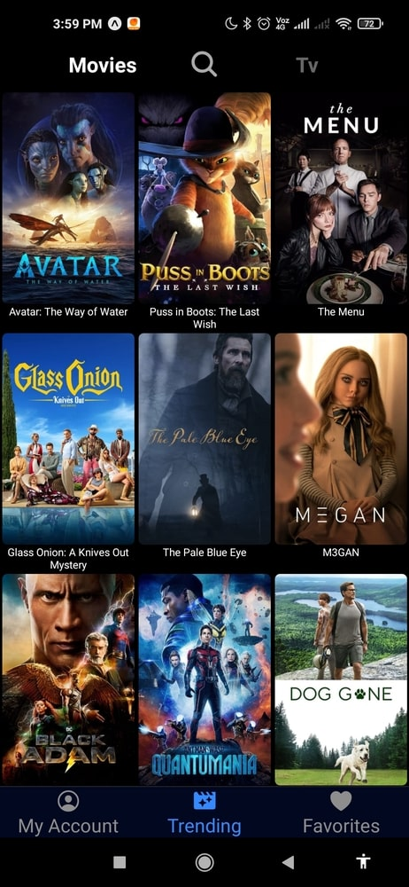
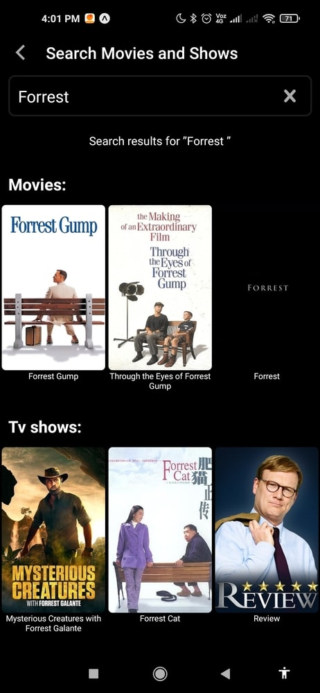
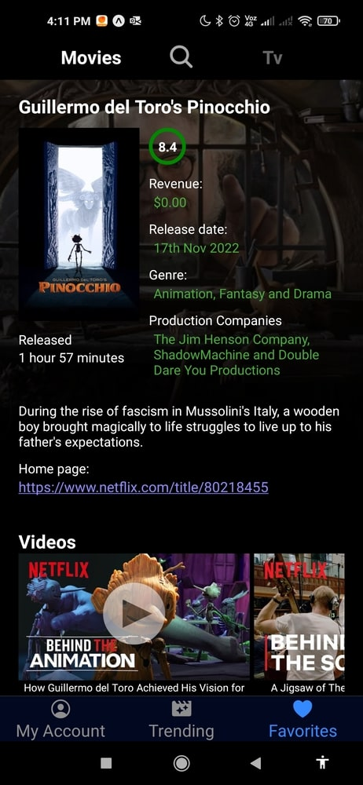
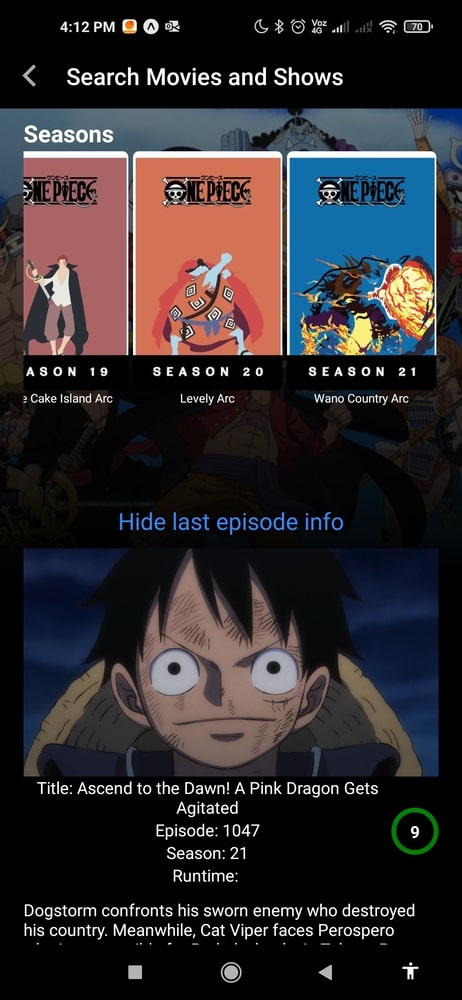

# MaiMovies

Mobile App to create, edit and manage your own lists of movies and tv shows.

## Video (open it in youtube)

## About this project

I realize I didn't have any project using React native to show yet, and I also realized I'm used to receive tons of recommendations of movies and series from my friends but since I don't write them down, I forget many of them.

So! I decided to fix both issues at the same time building this app for me (And for anyone who wants to use it of course)

## Features

Create infinite number of lists if your account

See latest tendencies of movies and tv shows

Search for any movie or tv show.

See detailed and actual information about your movies, like Revenue, release date, genre, production companies, public rate, among others.

In the case of tv shows, the same info is available as well as some extra information like season or even info about the latest released episode.

